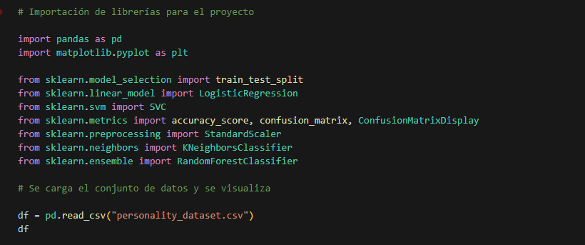
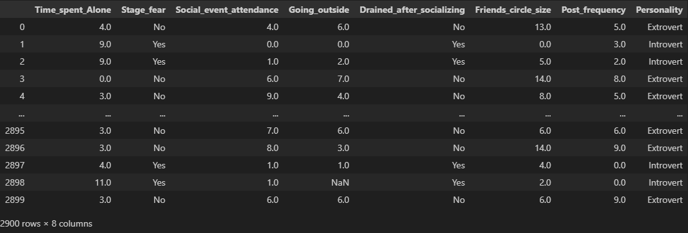
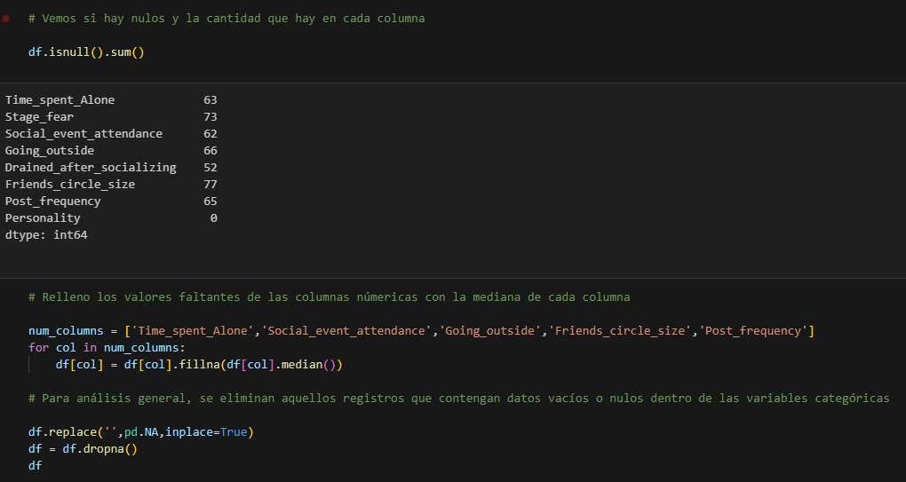
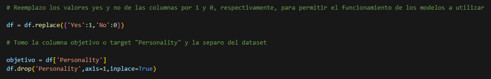
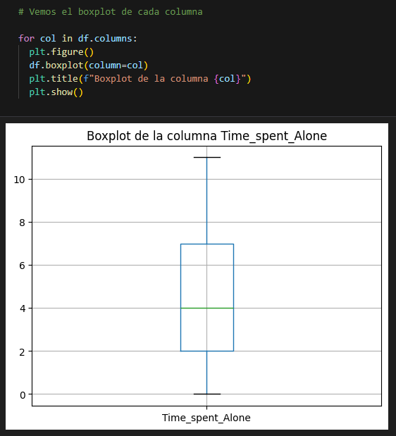
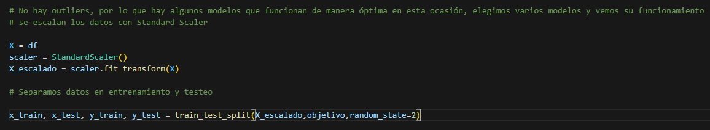
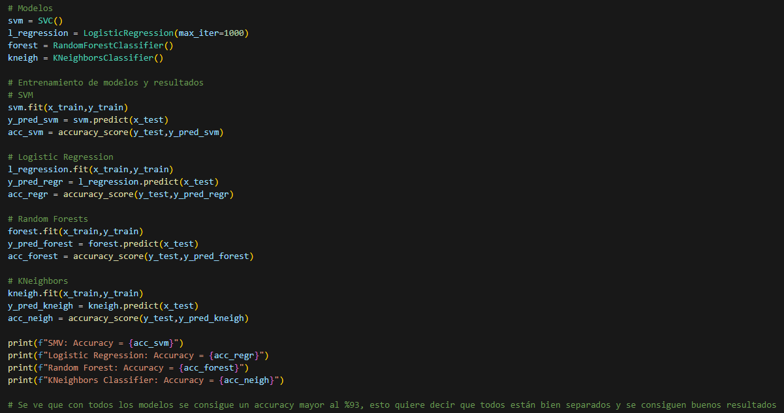
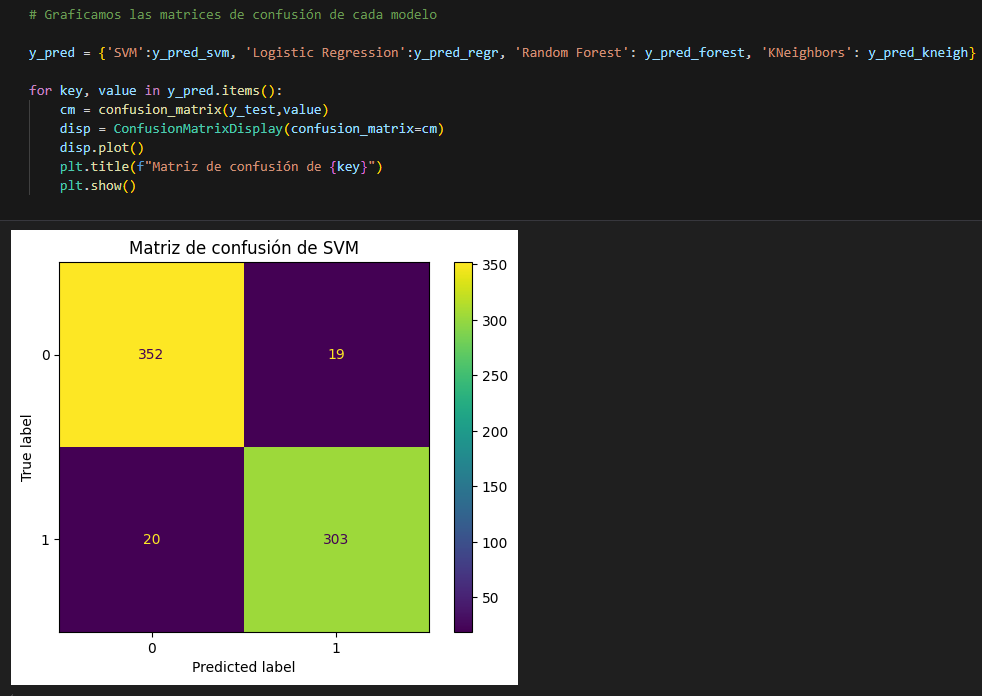
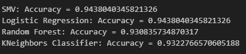

# Extrovertidos vs Introvertidos - Datos Sobre Comportamiento Social

## Descripción General
El comportamiento humano puede ser caracterizado por muchas variables. Dentro de este proyecto, se analizó el dataset *Extrovert vs. Introvert Personality Traits*, que incluye una colección de datos conductuales y sociales de las personas, capturando indicadores claves de la introversión y extroversión, convirtiéndose en una fuente de información para psicólogos, analistas de datos e investigadores que deseen involucrarse en estos estudios.

## Contexto
Rasgos de la personalidad como introversión y extroversión estructuran la forma en que interactuamos socialmente. Para poder definir a una persona y predecir su carácter, se midieron ciertas variables:

- `Time_spent_Alone`: horas que se pasan solo (0-11).
- `Stage_fear`: presencia de miedo escénico (Yes/No).
- `Social_event_attendance`: frecuencia con la que atiende eventos sociales (0-10).
- `Going_outside`: frecuencia con la que sale de casa (0-7).
- `Drained_after_socializing`: agotamiento luego de socializar (Yes/No).
- `Friends_circe_size`: cantidad de amigos cercanos autorreportados (0-15).
- `Post_frequency`: frecuencia de posteo en redes sociales (0-10).
- `Personality`: variable objetivo (Extrovertido/Introvertido).

El dataset contiene 2.900 líneas y 8 columnas en formato **csv**.

Para analizar y predecir la variable objetivo, se utilizaron cuatro modelos de Machine Learning supervisado (esto quiere decir que ya se poseen las etiquetas de la variable objetivo), siendo estos:

- **SVM (Support Vector Machine)**: algoritmo que se utiliza para clasificación y regresión. Funciona mediante la construcción de un hiperplano o conjunto de hiperplanos en un espacio de dimensionalidad alta que busca la mejor separación entre clases. [SVM Sklearn](https://scikit-learn.org/stable/modules/svm.html)
- **Logistic Regression**: análisis de clasificación para predecir resultados de variables categóricas en función de variables independientes. [Logistic Regression Sklearn](https://scikit-learn.org/stable/modules/generated/sklearn.linear_model.LogisticRegression.html)
- **Random Forest Classifier**: combina el resultado de múltiples árboles de decisión para llegar a un resultado único, prediciendo productos más precisos. [Random Forest Sklearn](https://scikit-learn.org/stable/modules/generated/sklearn.ensemble.RandomForestClassifier.html)
- **Kneighbors Classifier**: estima el valor de la probabilidad de que un elemento *x* pertenezca a cierta clase, a partir de la información proporcionada. [KNeighbors Sklearn](https://scikit-learn.org/stable/modules/generated/sklearn.neighbors.KNeighborsClassifier.html)

## Desarrollo 

Se realiza la importación de las librerías necesarias y se carga el conjunto de datos.

  
  

Se chequea la cantidad de valores nulos o vacíos. Las columnas númericas con nulos se rellenan con la mediana de cada una y se quitan del análisis aquellos registros que poseen nulos en las columnas categóricas.

  

Se reemplazan los valores *Yes/No* por 1 y 0, respectivamente. Se define la variable objetivo, se quita del dataset inicial y se factoriza, para la comprensión de los modelos a utilizar.

  

Se realiza un boxplot de cada columna, para una exploración visual de los datos.

  

Escalado de datos y separación en entrenamiento y testeo. Para la división, se tomaron los parámetros por default de la función *train_test_split*.

  

Se definen los modelos y se entrenan. Se imprimen los valores de *accuracy*.

  

Se plotean las matrices de confusión. Esta evalúa el rendimiento de los modelos, mostrando los casos correctamente clasificados (diagonal principal) y los incorrectamente clasificados.

  

## Conclusiones

Los cuatro modelos de clasificación obtuvieron un *accuracy* mayor al 93%, lo que indica que dividen por clase de manera fiable, y pueden utilizarse para predicciones de este estilo. Cabe destacar que se trata de un dataset con pocos registros y sin outliers, lo que permite una adaptación a la mayoría de modelos, sin presentar mayores dificultades en el entrenamiento y la obtención de buenas métricas de rendimiento.

  

