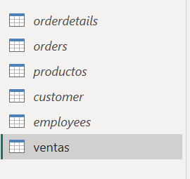
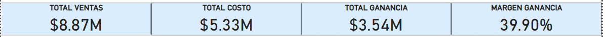
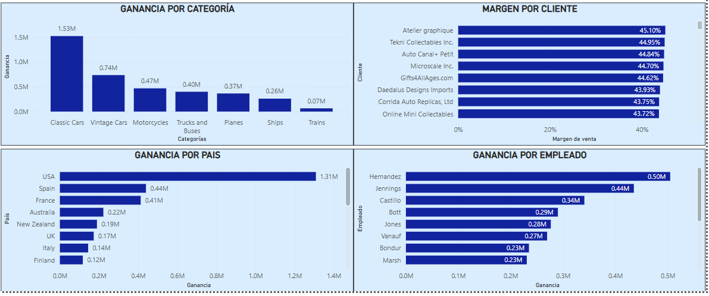

## CLASSIC MODELS LTDA

Este proyecto está basado en la empresa ficticia **Classic Models LTDA**. A partir de la exploración de varios conjuntos `.csv` relacionados con sus operaciones, se realizó un análisis financiero de la compañía y presentó un dashboard interactivo con distintos KPIs para evaluar el rendimiento.

  

## Conjunto de datos
Se utilizaron cinco conjuntos de datos en formato `.csv` para el proyecto:

- `customer`: información de clientes
- `employees`: información de empleados
- `orders`: órdenes realizadas
- `orderdetails`: detalles de las órdenes realizadas
- `products`: información de los productos pedidos

## Transformación de datos
En un primer análisis, mediante **Power Query**, se combinaron las tablas por distintas claves relacionales, resultando en la tabla *ventas* que contenía toda la información sustancial para el proyecto.

  

- Se ocultaron las tablas originales para evitar mostrar campos innecesarios.
- Se eliminaron columnas irrelevantes.
- Se crearon columnas calculadas:
  - `monto_venta` = cantidad_pedida x precio_venta
  - `monto_compra` = cantidad_pedida x precio_compra
  - `monto_ganancia` = monto_venta - monto_compra   

## Modelado y KPIs
Mediante el lenguaje **DAX**, se calcularon e insertaron KPIs claves, que ayudan al análisis general de la situación financiera de la empresa.

- Total de ventas
- Total de costos
- Total de ganancia
- Margen de ganancia

  

## Visualización
Se incluyen visualizacion interactivas que permiten analizar:

- Ganancia por categoría de producto
- Margen por cliente
- Ganancia por país
- Ganancia por empleado

  

## Notas
- Todo lo realizado es con fines educativos
- Los datos y proyecciones utilizadas son ficticios
