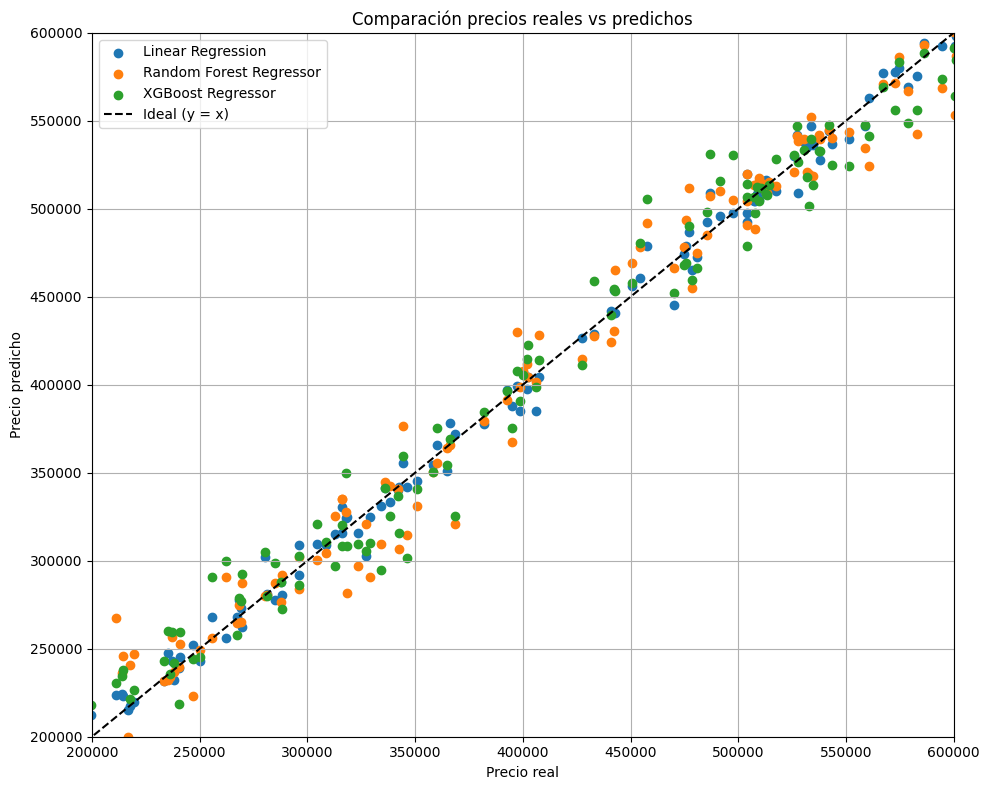

# Regresión para la predicción de precios de inmobiliarios 

## Descripción General
Los precios de una propiedad pueden ser influenciados por varias características propias del inmueble. Para el presente trabajo, se analizó el dataset de Kaggle *house_price_regression_set* que recaba información de varias propiedades.

## Contexto
El terreno, la cantidad de habitaciones, la antigüedad, étc, moldean el valor que recibe una propiedad. Para la predicción, se utilizaron las siguientes variables:

- `Num_Bedrooms`: cantidad de habitaciones.
- `Num_Bedrooms`: cantidad de baños.
- `Year_Built`: año de construcción.
- `Lot_Size`: tamaño del terreno total (m2).
- `Garage_Size`: cantidad de autos que entran en el garage.
- `Neighborhood_Quality`: rating de la calidad del barrio (1-10).
- `Age`: edad de la propiedad.
- `Square_Meters`: metros cuadrados que posee la propiedad (m2).

El dataset contiene 1000 líneas y 9 columnas en formato **csv**.

Para el desarrollo y predicción de la variable objetivo, es utilizaron tres modelos de regresión:
- **Regresión Lineal**: modela la relación entre una variable dependiente y una o más independientes. [Lineal Regression Sklearn](https://scikit-learn.org/stable/modules/generated/sklearn.linear_model.LinearRegression.html)
- **Random Forest Regressor**: combina múltiples árboles de decisión para hacer predicciones, especialmente eficaz para valores continuos. [Random Forest Regressor Sklearn](https://scikit-learn.org/stable/modules/generated/sklearn.ensemble.RandomForestRegressor.html)
- **XGBoost Regressor**: crea árboles de decisión de manera secuencial, tratando de que cada nuevo árbol tenga menor error que el anterior. [XGBoost Regressor](https://xgboost.readthedocs.io/en/latest/python/python_api.html)

## Desarrollo

Se importan las librerías necesarias y se cargan los datos.

  

Se ve la información del dataframe y se realiza un chequeo de valores nulos.

  

Se realiza un boxplot de cada variable, para inspección de outliers.

  

Se grafica la matriz de correlación, con ella se puede ver la relación que tiene cada variable con otra.

  

Se eligen las variables de entrenamiento y objetivo, y se escalan.

  

Se separa en entrenamiento y testeo, se definen los modelos, se entrenan y luego se imprimen los valores de error absoluto medio y error cuadrático medio de cada uno.

  

Se grafican los puntos de cada predicción vs los reales, para ver que tan acertado está cada modelo.

  

## Conclusiones

**Linear Regression** -> MAE:7657.77, MSE:94355212.83

**Random Forest Regressor** -> MAE:15288.48, MSE:391750142.86

**XGBoost Regressor** -> MAE:14562.75, MSE:325534384.68

Al evaluar los errores obtenidos, se llega a la conclusión que el modelo que mejor predice la variable objetivo es el modelo lineal, al tener menor error absoluto y cuadrático. Esto puede deberse a que se trata de un conjunto de datos en la que las variables están relacionadas de una forma lineal y directa con el precio, haciendo
que un modelo simple generalice eficientemente. Los modelos como Random Forest Classifier y XGBoost son complejos, aplicables a datasets de mayor tamaño y dificultad, y susceptibles a overfitting cuando la cantidad de datos es pequeña.

