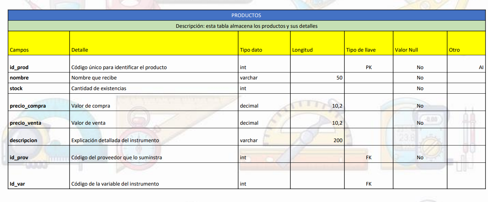

## NEGOCIO INSTRUMENTOS DE MEDICIÓN

Se modeló un negocio de instrumentos de medición que se encarga tanto de la venta como de la calibración de equipos. Esta posee una lista de empleados con dos categorías, comercial y técnico, que se encargan tanto de las ventas como las calibraciones, respectivamente. Los instrumentos trabajados en el lugar tienen asignado un registro para diferenciarlos respecto de la variable que miden, sean estas temperatura, humedad, presión, étc. Tanto los proveedores como los clientes, disponen de códigos únicos para poder registrarlos y tener su información a mano. Como todo negocio, se lleva un registro de las transacciones realizadas, cada una con su detalle.

  

Como parte también del modelado, se fue realizando una descripción de cada tabla, con el detalle de los campos involucrados en cada una.

  

Una vez definido el código SQL utilizado para la creación de la base de datos relacional, se realizó una breve descripción de las vistas (views), funciones (functions), procedimientos (stored procedures) y
disparadores (triggers) que se desarrollaron en el proyecto.

### Vistas
- **Vista de cliente por ubicación (vw_clientes_x_ubicación)**: esta vista muestra la cantidad de clientes que hay por barrio/zona de la
ciudad. El objetivo es tener una muestra de donde se tiene una mayor prominencia de clientes, para poder optimizar entregas y, en un
futuro, potenciar campañas de publicidad en barrios de menor densidad.
- **Vista tipo de empleado (vw_tipo_emp)**: esta vista muestra la cantidad de empleados por su tipo, comercial o técnico. Se puede
usar para ver si es necesario agregar más empleados llegado el caso.

### Funciones
- **CalcularGananciaBruta**: hace un cálculo entre el precio de compra del producto (al proveedor) y el precio de venta al público. A partir de
este resultado, se pueden hacer otras cuentas para distribuir esta ganancia bruta.
- **CalculoAntiguedad**: calcula la diferencia entre la fecha de ingreso de un empleado y la actualidad. De esto, se pueden generar bonos a
aquellos con mayor tiempo en la empresa y generar incentivos para los más nuevos.

### Procedimientos
- **AñadirCliente**: en caso de que un empleado lo requiera, pueda agregar un cliente con facilidad.
- **IniciarCalibracion**: el empleado puede fácilmente comenzar un servicio de calibración.

### Disparadores
- **Stock bajo (tr_stock_bajo)**: al hacer una transacción y modificar stock, en caso de que el stock esté cerca de ser cero, se envía una
alerta al empleado para que esté al tanto y avise a la persona responsable.
- **Nuevos clientes (tr_nuevos_clientes)**: al insertar nuevos clientes en la tabla de clientes, se registra esta inserción en una tabla extra
llamada registros, para llevar un historial desde que se implementa la nueva base de datos.

Finalmente, se realizaron reportes a partir de los datos, para facilitar el análsis y la toma de decisiones.

  
  

